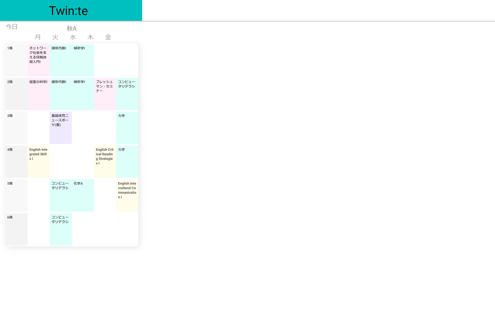
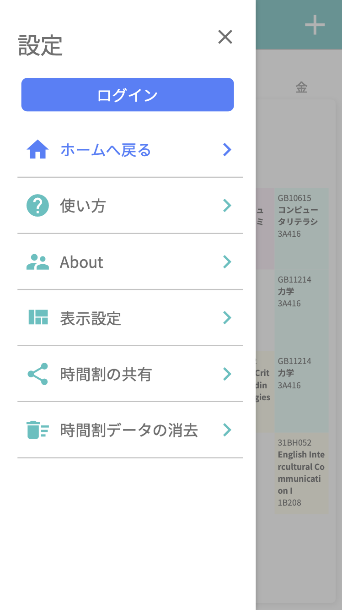
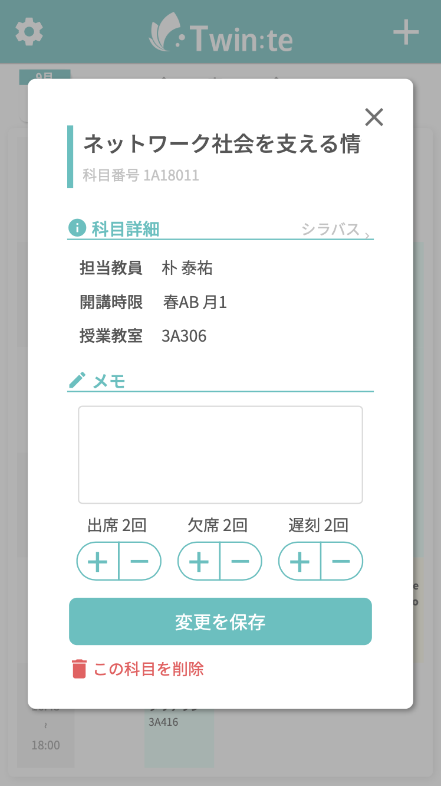
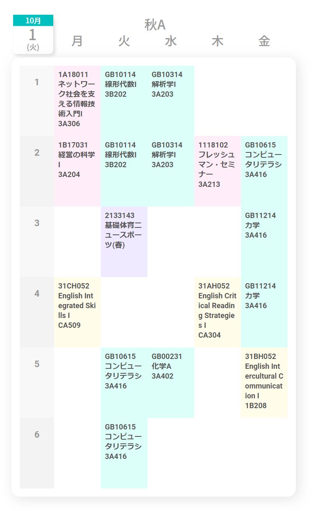
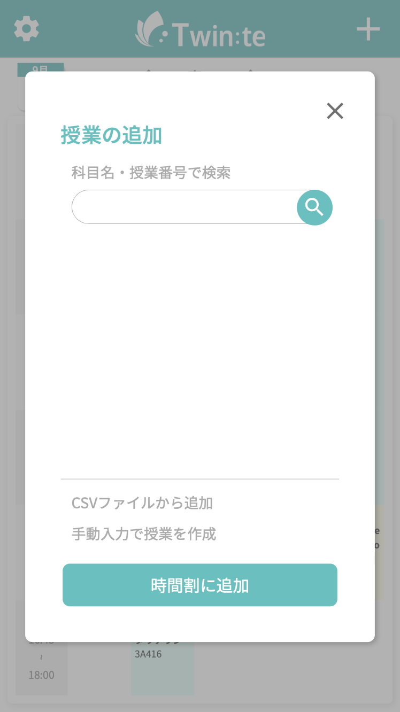

# twinte-front

twinte のフロントエンドです。WIP。



## Development

リポジトリをクローンして依存ライブラリをインストールします。

```
$ git clone git@github.com:twin-te/twinte-front.git
$ cd twinte-front
$ yarn
```

ローカルホストで動かします。

```
$ yarn dev
```

ビルドします。`.nuxt`に吐き出します。

```
$ yarn build
```

ビルドしてスタートします。`.nuxt`に吐き出してスタートします。

```
$ yarn start
```

リントします。`@typescript-eslint/parser`を使っているのでちょっと遅いです。fix までするときは`:fix`をつけます。

```
$ yarn lint
or
$ yarn lint:fix
```

フォーマットをします。Prettier の標準ルールに準拠しています。

```
$ yarn format
```

## name

toolbar: 上部のバー


navigation: サイド（左）のバー


dialog: ポップアップ画面


ripple: タップしたときのエフェクト

## file structure

[layouts/default.vue](src/layouts/default.vue): toolbar, navigation, dialog の基本構造


[pages/index.vue](src/pages/index.vue): 時間割画面


[components/def-](src/components): default.vue で用いるコンポネントをまとめたもの

[components/app-](src/components) : pages 内で用いるコンポネントをまとめたもの

[components/app-day.vue](src/components/app-day.vue): 時間割の右上に表示するカレンダー

[components/def-dialog-add.vue](src/components/def-dialog-add.vue): 科目追加画面


[components/app-table-contents.vue](src/components/app-table-contents.vue): 時間割本体。semester を引数にとって表示するデータを変えている。

[components/ui-](src/components) : components 内で用いるコンポネントをまとめたもの

[components/ui/nav-list.vue](src/components/ui-nav-list.vue) : リスト型の表示を nav.vue で用いる

[components/ui/ripple.vue](src/components/ui-ripple.vue) : これで囲うと ripple になる

## 次やること

- 設定画面作成
- 科目追加機能実装
- バックエンドとのやりとり
- ログイン機能実装
